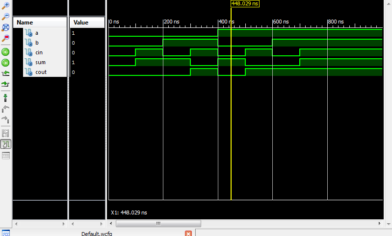

Lab2
====

#Truth Table
#Truth Table

| A | B | Cin | Sum | Cout |
|---|---|-----|-----|------|
| 0 | 0 |  0  |  0  |   0  | 
| 0 | 0 |  1  |  1  |   0  |
| 0 | 1 |  0  |  1  |   0  |
| 0 | 1 |  1  |  0  |   1  | 
| 1 | 0 |  0  |  1  |   0  | 
| 1 | 0 |  1  |  0  |   1  | 
| 1 | 1 |  0  |  0  |   1  | 
| 1 | 1 |  1  |  1  |   1  | 

